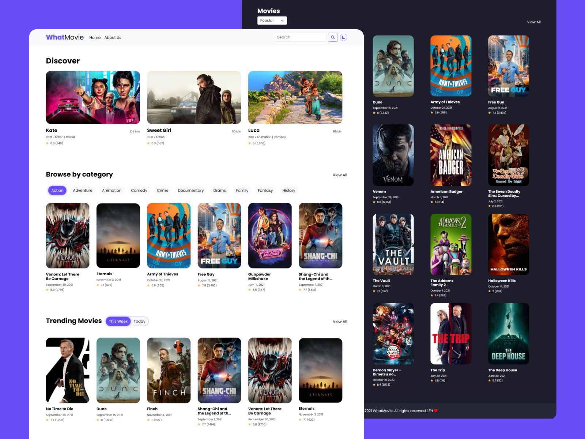

# WhatMovie



## Description

WhatMovie is a website that provides information about all the movies that have been or will be released. You can search for your favorite movie by writing the name of the movie in the `search` section, you can also find movies by `category`, `trending`, and others. You can also see detailed information for each movie, some of the information contained in it such as rating, release date, overview, and also the video trailer.

## Teknologi

This website was built using several technologies in it, including:

- [Next.js](https://nextjs.org/)
- [Bootstrap](https://getbootstrap.com/)
- [Axios](https://github.com/axios/axios)

## API

This website uses the API of [themoviedb.org](https://www.themoviedb.org/documentation/api), and of course requires `api-key` so that the API on this website can run. You can register first at [themoviedb.org](https://www.themoviedb.org/documentation/api) to get `api-key`. After getting the api key, you can enter the `api-key` in the `env` file.

```env
NEXT_PUBLIC_KEY="api_key=<your api_key>&language=en-US"
# <your api_key> replaced with your own api-key
```

## Development

If you want to try to do the development process, make sure your device has installed [nodejs](https://nodejs.org/en/).

You can download this repository by clicking `Code` at the top, then selecting `Download ZIP` or if you want to clone this repository you can do this by

```bash
git clone https://github.com/fajarhidayatt/whatmovie.git
```

After that, install all the packages / dependencies contained in this project

```bash
npm install
```

Then run the development server

```bash
npm run dev
```

Open [http://localhost:3000](http://localhost:3000) in the browser you are using to see the results.

## Demo

You can see a demo of this website at [jarh-whatmovie.vercel.app](https://jarh-whatmovie.vercel.app)
